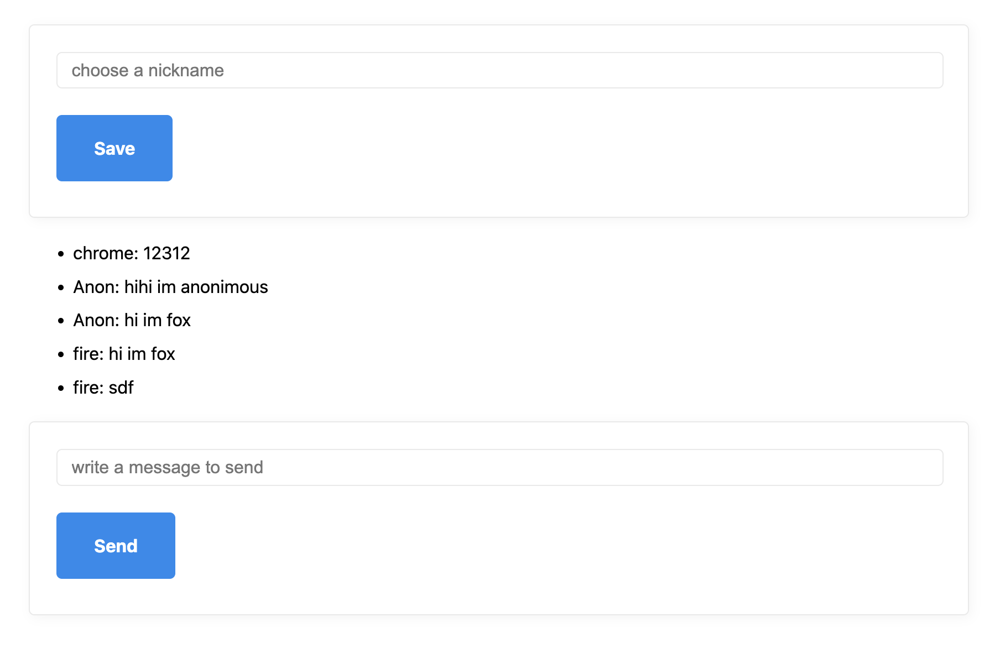

# 니콜라스 줌 클론코딩

## CHAPTER.1 CHAT WITH WEBSOCKETS Conclusions
### REVIEW
- 기본 환경 세팅
    * babel, nodemon 환경 세팅
    * prettier 세팅
- 프론트-백엔드 간 메시지 발신/수신
- 닉네임, 받은 메시지 화면에 보여주기

### TODO
- 내가 보낸 메시지는 **나를 제외한 사람**에게 전달하기
- 백엔드에서 프론트로 메시지 보낼 때 json으로 보내기
- 프론트에서 받은 json을 파싱하기
---
## CHAPTER.2 SOCKET IO
### Socket.io란?
- 실시간, 양방향, 이벤트 기반 통신 제공
- WebSocket을 사용할 수 있으면 사용하나, WebSocket을 지원하지 않더라도 다른 것을 사용해서 통신이 가능하도록 함.
- 프론트, 백엔드 간 실시간 통신을 지원.
- WS보다 조금 무거움(WS : 119KB, Socket.io : 1.03MB)
